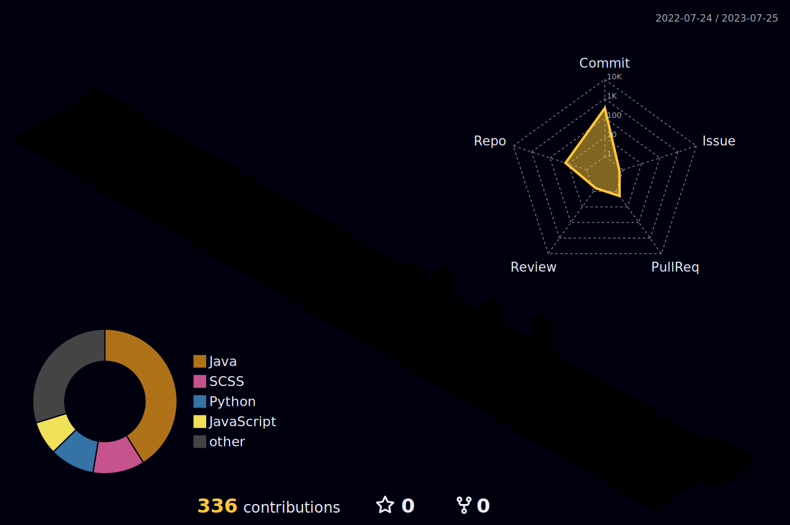

  

<!--

-->

  <!-- Dodam's Githun stats -->
  
  <!-- Top Langs -->
  

<!-- 3D 잔디  -->

## 💬 &nbsp; About me
  

    I'm currently learning back-end skills and front-end skills 🐣
  

 

#### 🛠️ &nbsp; Tech Stack
   
   
   
   
   
   
   
   
   
   
   <!--  -->
   <!--  -->
   <!--  -->
   <!--  -->
 

#### 📨 &nbsp; Contact

  
    
    

